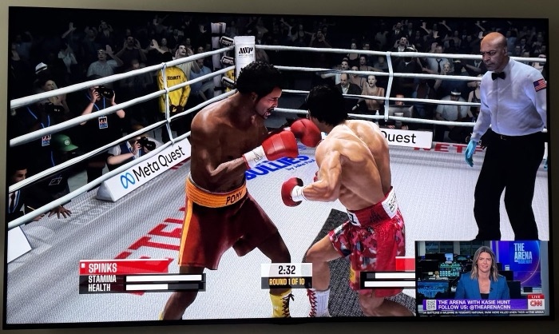
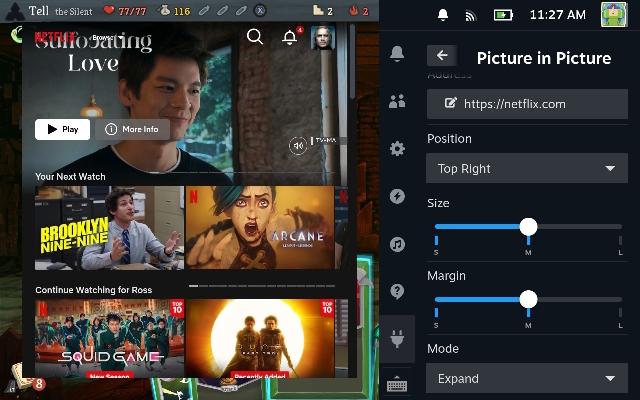

# Steam PiP

A picture-in-picture plugin for Decky Loader that gives you flexible, floating picture-in-picture viewing on the Steam Deck and **Steam Machine**. It floats a small, resizable browser window — a live stream, a video, whatever URL you give it — over whatever game you're playing, so you can keep an eye on it without leaving the game.

Works out of the box with **YouTube**, **Twitch**, and **.m3u8 (HLS) streams** from local DVRs (like Channels DVR) and IPTV providers — plus anything else you can point a browser at.





## Features

- **Picture-in-picture or expanded view** — a small floating box you can position in any corner/edge, or blow up to a large near-fullscreen view, toggled with one button.
- **Works with streaming sites and raw streams** — YouTube, Twitch, and other browser-playable sites work directly; `.m3u8` (HLS) URLs from a local DVR (Channels DVR, etc.) or an IPTV provider are routed through a bundled HLS.js player so they play instead of triggering a download prompt.
- **Saved channels/bookmarks** — save any number of URLs as named channels, pick from a dropdown, or cycle through them with a "Channel Surf" up/down control.
- **Playback controls** — play/pause, jump back/ahead 10 seconds, volume and mute, all overlaid on the picture without needing to click into the embedded page.
- **Quiet-by-default volume curve** — the volume slider is tuned for background/second-screen listening: quiet is genuinely quiet and audible, and even the top of the slider stays well under full volume, so it never overpowers whatever game you're playing.
- **"Now playing" guide info (optional)** — if a channel has an XMLTV guide URL attached (e.g. from Channels DVR), Steam PiP shows what's currently airing, both as persistent text in the panel and as a brief overlay on the picture itself. This is entirely optional and can be attached to any channel, from any guide source, by any user — not just channels from one particular DVR. A single toggle turns it off completely (no background polling at all) if you don't want it.
- **Export/import your channel list** — back up your saved channels to a JSON file, or restore them, using Decky's own native file picker — you choose the folder, filename, and source file yourself, and importing lets you append to or overwrite your current list.

## Requirements

This is a plugin for **[Decky Loader](https://decky.xyz/)**, the plugin loader for SteamOS. Decky Loader isn't made by Valve — it's a community project that has to be installed once before any of its plugins (including this one) will work. If you don't already have it:

1. Install Decky Loader by following the instructions at [decky.xyz](https://decky.xyz/). This adds a new plugin icon to Game Mode.
2. Once Decky Loader is installed, come back here to install Steam PiP itself.

## Installing Steam PiP

Since this plugin isn't in the Decky store (see below), it installs from a ZIP file:

1. Download the latest `decky-steam-pip.zip` from [Releases](https://github.com/Fofer/decky-steam-pip/releases), or build it yourself (see "Building" below).
2. Open the Decky Loader menu (the plug icon in Quick Access), go to Settings, and turn on **Developer Mode**.
3. A new "Install Plugin from ZIP" option appears under the Developer tab — use it to select `decky-steam-pip.zip`.
4. Steam PiP now shows up in the Decky Loader menu (Quick Access) with its own icon.

## Using it

Open the Decky Loader menu, select **Steam PiP**, and hit **Open**. From there you can:

- Add channels (the **+** button) — give a channel a name, a URL, and optionally a TV guide (XMLTV) URL for "now playing" info
- Pick a saved channel from the dropdown, or cycle through them with the Channel Surf (up/down) buttons
- Control playback — play/pause, jump back/ahead 10s, volume, and mute
- Toggle **Expand** for a large near-fullscreen view, or leave it off for a small picture-in-picture box
- **Hide** the picture temporarily, or **Close** it
- Reorder, edit, or remove channels, and export/import your whole channel list as a backup

## Works on Steam Deck and Steam Machine

Fork of [rossimo/decky-pip](https://github.com/rossimo/decky-pip), which appears unmaintained. The original hardcoded Deck-only screen dimensions, which placed the picture-in-picture window incorrectly on any other device (e.g. a Steam Machine driving a TV). This fork detects the device and adjusts: a screen reporting Steam Deck's known native panel resolution (1280x800, true for both LCD and OLED) keeps the original, unmodified placement math; any other device measures its actual on-screen window size at runtime and places the picture correctly relative to it. See `src/screen.tsx` and `getScreenBounds()` in `src/pip.tsx`.

## Why isn't it in the Decky Store

The Decky Store's submission process requires confirming that generative AI was not used to write the majority of the code. Most of this fork — including everything added on top of the original `decky-pip` — was written with the help of Claude, an AI assistant, so that box can't be checked honestly. As a result, it's available as a manual ZIP install instead.

## Building

```
pnpm install
pnpm run build
```

This produces `dist/index.js`. Zip the plugin folder (`plugin.json`, `dist/`, and the other top-level files) to get something Decky's "Install Plugin from ZIP" can use.
